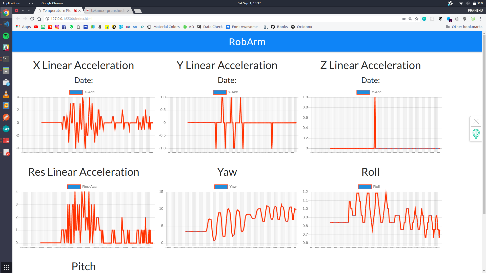

<h1 align="center"> Elek-a-thon</h1>

## Elek-a-thon was an electronics hackathon organised by Aakash Research Lab & Department of Electronics & Communication Engineering , SRM Institute of Science & Technology on 31 August 2018.

<h3 align="center">Real time data from the sensor</h3>

---

Me with my teammate Aakarsh Singh Saini who plenty of experience in electronics and SBCs came up with an idea of Robotic Arm which can be controlled remotely.

Nowadays it takes a lot of time for specialised surgeons/doctors to reach patient. In order to solve this issue the surgeon/operator is able to operate the robotic arm at a far away location with the help of a specialised glove which is equipped with a bunch of sensors.

## What we done ?
We hooked up the orientation sensor with the arduino which sends the data , which then read by the Node.js via serial communication.

Which in turn seved via server , received by client & further processing can be done.

### Data
- X-axis Liner Acceleration
- Y-axis Liner Acceleration
- Z-axis Liner Acceleration
- Resultant Liner Acceleration
- Yaw
- Roll
- Pitch

Technologies Used :
- Node.js
- Express.js
- Socket.io
- Chart.js
- Serialport

---

## Members
- ### [Pranshu Chittora](https://github.com/pranshuchittora)
- ### [Aakarsh Singh Saini](https://github.com/aakarsh5145)